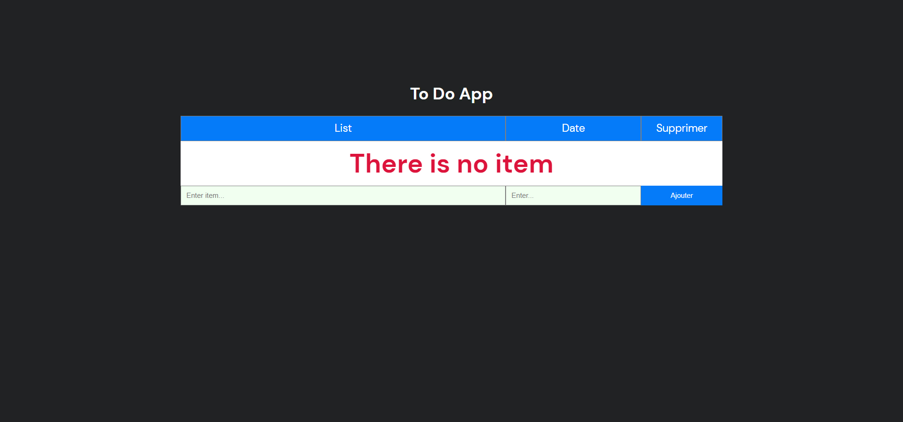

# To Do List-App

User-friendly to-do list application that helps you organize and manage your tasks efficiently. Create, prioritize, and track your tasks. Stay productive and focused with this easy-to-use to-do list app.

## Table of Contents
- [Installation](#installation)
- [Features](#features)

## Installation

To install and run this project, follow these steps:

1. Clone the repository:
   git clone https://github.com/Ska9/To-Do-List.git
   
2. cd To-Do-List
  
3. npm install

4. npm start

## Features

- Create tasks and add them to the to-do list.

- Delete tasks from the to-do list.

